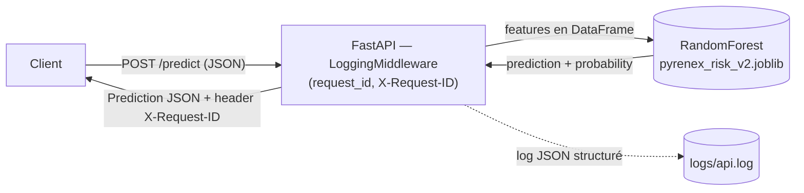

# Pyrenex Risk API — M1-B2

API FastAPI servant le modèle de scoring crédit `pyrenex_risk_v2` (issu de M1-B1) : prédiction de risque de défaut (`Fully Paid` / `Charged Off`) à partir des caractéristiques d'une demande de prêt.

## Schéma



---

## 🚀 Démarrage

```bash
docker build -t pyrenex-risk-api:0.1.0 .
docker run -d -p 8000:8000 --name pyrenex-api pyrenex-risk-api:0.1.0
curl http://localhost:8000/health
```

---

## 📡 Exemple `/predict`

```bash
curl -X POST http://localhost:8000/predict \
  -H "Content-Type: application/json" \
  -d '{
    "loan_amnt": 10000,
    "term": "36 months",
    "int_rate": 12.5,
    "annual_inc": 55000,
    "purpose": "debt_consolidation",
    "installment": 320.50,
    "dti": 18.5,
    "delinq_2yrs": 0,
    "fico_range_low": 700,
    "revol_util": 45.3,
    "grade": "B",
    "emp_length": "5 years",
    "home_ownership": "MORTGAGE",
    "verification_status": "Verified"
  }'
```

Réponse :

```json
{
  "prediction": 0,
  "probability": 0.1832,
  "model_version": "v2.0.0",
  "request_id": "1a841d9d-e8f1-4c96-8471-e8a99a365bf4"
}
```

---

## 🏷️ Versionning

La version **servie à l'instant T** se lit à deux endroits, qui doivent rester synchronisés :

- **`GET /info`** — source de vérité runtime : `api_version` (celle de l'app FastAPI, `app/main.py`), `model_version` + `dataset_sha256` + `metrics_holdout` (lus dans `models/pyrenex_risk_v2.json` chargé au `lifespan`).
- **Tag git** — source de vérité du code déployé : `git tag v0.1.0-api` marque le commit correspondant à une version d'API buildée/déployée (`git tag -l`, `git describe --tags`). Un déploiement sans tag = pas de checkpoint de rollback.

En cas de doute sur ce qui tourne réellement (cf. l'incident de collision de port sur 8000), croiser `/info` avec `docker inspect <container> --format '{{.Config.Image}}'` pour confirmer quelle image est effectivement derrière le port.

---

## 🎯 Préparation M5

- **Auth** : `HTTPBearer` déjà scaffoldé sur `/predict` (non vérifié) — à durcir en Bearer/OAuth2 réel.
- **CI/CD gate** : les tests pytest actuels (contrat modèle + API) deviennent la porte de merge/déploiement.
- **Observabilité** : middleware Prometheus + dashboard, en complément du logging Loguru existant.
- **Model registry** : remplacer la copie manuelle du `.joblib` par MLflow Registry ou DVC.
- **Scaling** : rate limiting, orchestration Kubernetes/autoscaling, tests de charge (Locust/k6).
